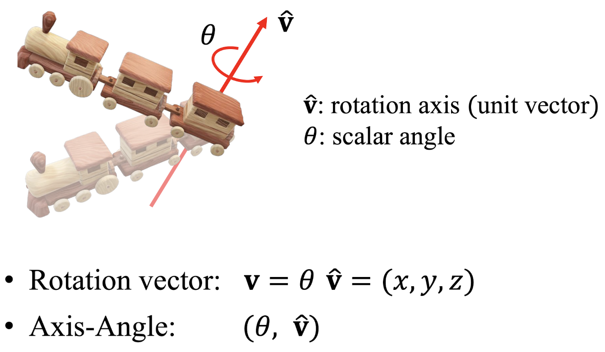
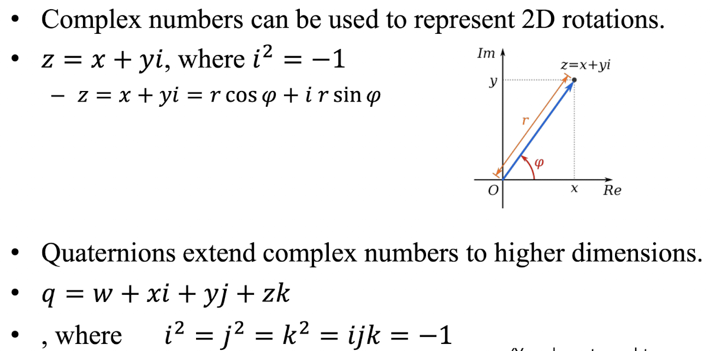

## Computer Graphics Chapter 9 - (Orientation & Rotation)
- Reference : [https://chickencat-jjanga.tistory.com/36](https://chickencat-jjanga.tistory.com/36)

### State vs. Difference (7p)

- [linear] position은 위치 "상태", displacement는 위치 "차이"
- [affine] point는 점 위치 "상태", vector는 두 점 사이 "차이" 또는 방향과 크기
- [angular] orientation은 물체의 각도적 "상태", rotation은 두 orientation 사이의 각도 "차이"

### Analogous Operations: Points/Vectors and Orientations/Rotations (8p)

- 점/벡터 연산처럼, Orientation/Rotation도 유사한 연산으로 설명 가능하다.
```
orientation + orientation -> UNDEFINED
rotation +(-) rotation -> rotation
orientation +(-) rotation -> orientation
orientation - orientation -> rotation
```
- Not vector addition & subtraction : 진짜 좌표 벡터처럼 성분끼리 더하고 빼는 뜻이 아니다. 회전은 순서가 중요하고, 축도 바뀔 수 있기 때문이다.

### Differences vs. Transformations (9p)
- Transformations 은 difference가 state를 바꾸는 것이다.
- [translation transform] linear displacement (displacement vector) 로 position을 바꾼다.
- [rotation transform] angular displacement (rotation) 으로 orientation을 바꾼다.
- reference position에 상대적으로 position이 포현된다 (using a displacement)
- reference orientation에 상대적으로 orientation이 표현된다 (using a rotation)

### Degress of Freedom (DOF) (11p)
- 고유한 configuration (구성, 배열, 형상) 을 명시하기 위해 요구되는 "독립 파라미터의 개수"
- DOF can describe either a state or an allowable movement.
    - "상태를 설명하는 DOF" : 3D 점 하나 위치 표현하는데 (x, y, z) -> 3 DOF
    - "허용된 움직임을 설명하는 DOF" : 문은 경첩 축 (1개의 축) 을 중심으로 돈다 -> 1 DOF
    - Any rigid motion in 3D space -> 6 DOF (3개의 축으로 이동 + 회전)

### Euler's Rotation Theorem (14p)
- 3D 물체가 "한 점을 중심" 으로 rigid-body movement를 했다면, 항상 어떤 하나의 축 (axis) 로 어떤 각도 (angle) 만큼 회전한 것과 같다. 
- 이로 인해 3D 회전 하나를 axis-angle로 표현할 수 있다.
> 표현은 가능하지만, 항상 깔끔하고 유일하게 표현되는 건 아니다.  
> 특정 자세에서는 gimbal lock이 생겨서, 하나의 자유도가 중복된다. 
> 최종 orientation을 아예 표현 못 하는 건 아니지만, 그 주변에서 표현이 불안정해진다. (smooth하고 one-to-one인 3-parameter 표현이 아니다.)

### 3D rotation and orientation 표현법 (17p)
- Eular angles
- Rotation vector (Axis-angle)
- Rotation matrices
- Unit quaternions

### Euler Angles (18p)
````
XYZ, XYX, XZY, XZX
YZX, YZY, YXZ, YXY
ZXY, ZXZ, ZYX, ZYZ
````

- 같은 축이 연속적으로 오지 않는다. 
- 세 개의 회전 각으로 3D orientation을 표현한다.

```
ZXZ Euler Angles

1. Rotate about Z-axis by a
2. Rotate about X-axis of the new frame(1) by b
3. Rotate about Z-axis of the new frame(2) by c

R = R_z(a) R_x(b) R_z(c) // body frame 기준 회전
```

- 대표적인 ZYX Euler Angles : Yaw-Pitch-Roll Convention
```
R = R_z(yaw) R_y(pitch) R_x (roll)
```

- Euler angles는 두 회전축이 정렬 (align) 될 때, 회전 자유도 (rotational DOF) 하나를 잃는다.
- 하나의 회전 자유도가 중복되어서, 실제로는 두 방향으로밖에 조작이 안 되는 상황이 생김. 다른 축이여도 비슷한 효과를 내게 된다. 
    - 특정 orientation에서 회전 자유도를 제대로 구분하지 못함.
    - 서로 다른 angle 조합이 같은 orientation을 나타낼 수 있다.


### Rotation Vector (Axis-angle) (25p)

- 회전축: v-hat (단위벡터), 회전각: theta
````
v-hat = (0, 1, 0) // 회전축이 y축
theta = pi/2 // 회전각이 90도

rotation vector v = pi/2 (0, 1, 0)
= (0, pi/2, 0)
````

- rotation vector만으로 점을 바로 회전시킬 수는 없다. -> 회전시키려면 rotation matrix가 필요하다.
- `v -exp-> R` 이 되는데, 여기서 exp는 matrix exponential (Lie group exponential map) 이다. -> 회전 벡터를 실제 회전 행렬로 펼치는 함수 
- (반대로 log 연산을 적용할수도 있다.)

### Rotation Matrix (27p)

- 회전행렬 R은 회전된 축 I_x, I_y, I_z 를 기저로 열벡터로 가진다.
    - rotated frame의 orientation을 정의한다.
    - reference frame에서 rotated frame으로 가는 rotation을 정의한다.

```
R * R^T = R^T * R = I
and
det(R) = 1

-> 행렬식이 1인 직교 행렬 (orthogonal matrix)
-> R^-1 = R^T

||Rv|| = ||v||| 임의의 벡터에 회전행렬을 적용해도 벡터 길이는 변하지 않는다. (회전)
```

- The set of all 3 x 3 rotation matrices : special orthogonal group `SO(3)`
- `det(R) = -1` : 반사

### Quaternions (쿼터니언) (30p)

- 복소수가 2D rotation을 표현하는데 사용될 수 있다? `z = x + yi`
- 쿼터니언을 어떻게 이해할 수 있을까?